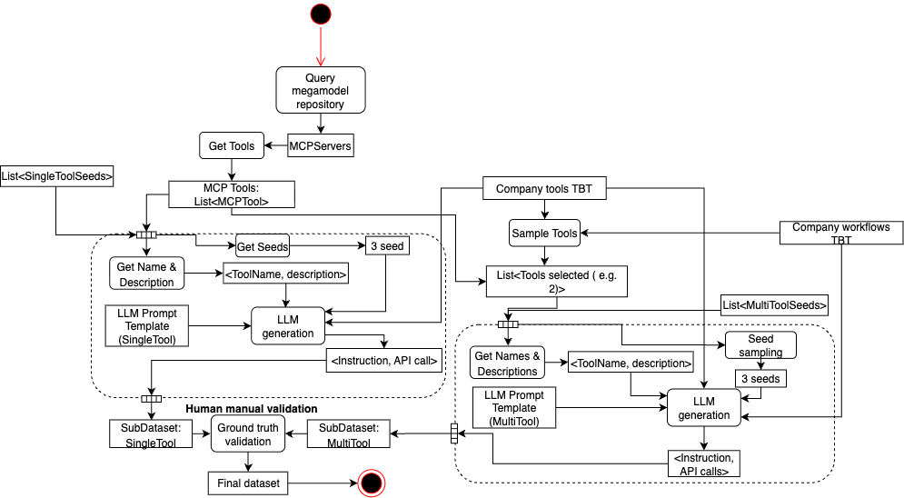

UPDATED VERSION (HUGO):
# A Megamodel-based Approach to Support Ecosystems of LLM Agents for Model-Based Engineering

## Abstract

// Context
The Model-Based Engineering (MBE) of large and complex software-intensive systems require to perform many engineering tasks over time. These tasks imply to create, modify, and reason on different modeling artifacts (metamodels, models, etc.) manipulated with various modeling tools (for model transformation, model views, etc.). In this context, the involved engineers could clearly benefit from intelligent agents that could support them in performing more efficiently their MBE tasks.

// Challenge
Recently, new initiatives appeared with the objective to agentify individual MBE tasks (e.g. model transformation) by relying notably on Large Languages Models (LLMs). However, automatically (at least partially) designing and executing complete modeling workflows in a smart way remains challenging. This is more particularly the case if we now consider combining together multiple MBE agents carrying out part of the targeted engineering tasks. Indeed, such LLM-based agents need to have access to the information related to all the available resources in order to be able to react appropriately.

// Solution
As a first step in this direction, we propose an approach that aims to provide the global knowledge on and to such a MBE agents ecosystem. Based on a dedicated megamodel we designed and the related tooling support, we can capture, represent, and reuse in an unified way all the required metadata. This concerns all the involved modeling artifacts, the corresponding tools and their associated LLM-based agents, as well as traces or logs of their practical executions in different contexts. Thus, in addition to modeling entities, the proposed megamodel registry also allows to track other useful elements such as MBE servers (e.g. using MCP), sessions or workflow plans.

// Results
We illustrate the applicability of the proposed approach and underlying tooled megamodel by applying them in the context of three complementary use cases. First, we consider the automated generation of datasets for MBE tools and workflows that a given company wants to test. Second, we collect the corresponding execution traces and navigate them to identify potential issues with the tested tools/workflows. Third, we reuse all the available information to generate a more detailed performance report targeting the improvement of workflow efficiency.

*****************

# LLM Agents for Model-Driven Engineering: A Megamodel-Based Approach

## Abstract

### Context

Agentification of model management tasks is emerging as practitioners seek to automate modeling workflows.
These worflows involve diverse tools that require coordination in order to manipulate diverse artifacts.
However, agents need complete information about modeling environments and execution contexts to understand available resources and plan workflows effectively.

### Challenge

While megamodels can capture comprehensive information about modeling environments, existing megamodels capture static relationships but do not track dynamic executions and tool interactions.

### Solution
We built a megamodel-based repository containing modeling artifacts, tools, agents, and execution traces.
The MegamodelRegistry tracks entities such as MCP servers, sessions, and workflow plans in a unified structure.

### Results
We demonstrate the usefulness of the proposed approach by illustrating an application it enables. We consider a company that has developed MDE-based agents and wants to perform performance optimization on them. We apply our repository in the context of three different applications that support their optimization process.
First, we generate datasets based on MCP servers registered in the megamodel and the tools and workflows the company wants to test.
Second, we collect historical traces from executions.
Third, we generate analysis reports by querying and navigating the repository.
This analysis enables performance optimization through workflow efficiency improvements.

## 1. Introduction

Model-Driven Engineering workflows require coordination between heterogeneous tools. Traditional approaches rely on manual orchestration by domain experts. Large Language Models enable automation of these workflows through agents.

MDE environments lack systematic approaches for exposing information to autonomous agents. A megamodel captures relationships between artifacts within an MDE ecosystem. Existing megamodels document static relationships but do not capture dynamic execution traces from tool interactions. This prevents agents from accessing information about workflows and execution history.

This paper presents a megamodel-based approach that serves as a repository for agent-driven MDE workflows. The approach integrates the Model Context Protocol to enable standardized communication with modeling servers. We demonstrate this through three phases: automated dataset generation, execution trace analysis, and report generation. The report generation phase produces analysis summaries, execution results, and instruction-level analysis as demonstrated in our outputs directory.

## 2. Architecture Overview

Figure 1 illustrates the core components of our megamodel-based approach. The architecture consists of four main layers that support agent-driven MDE workflows.

### 2.1 MegamodelRegistry

.png)

The MegamodelRegistry forms the central repository. It includes agent execution traces and tool interaction data. The registry maintains four key components:

**Modeling artifacts**: The registry stores entities including models, metamodels, and transformations. Each entity maintains relationships through directed links that capture dependencies, conformance, and transformations. Models conform to metamodels, transformations operate on specific model types, and reference models provide metamodel definitions. The registry tracks terminal models that represent instantiated models.

**Tooling artifacts**: This component maintains a catalog of Model Context Protocol (MCP) servers that provide transformation capabilities through standardized interfaces. Each MCP server exposes tools that perform modeling operations such as model validation, transformation execution, or code generation. The registry tracks which tools are available on each server and maintains resource mappings that specify input and output requirements for each tool. This enables automatic tool selection based on the current modeling context.

**Agent artifacts**: The registry stores agent-specific components including goals, workflow plans, and plan steps. Goals define objectives that drive the modeling process, while workflow plans decompose these goals into executable sequences of actions. Each plan step specifies the tools to invoke and the input artifacts required. The registry maintains the relationship between goals and plans to support plan reuse and adaptation.

**Execution traces artifacts**: This component captures the runtime behavior of agent-driven modeling processes. Execution traces record the sequence of tool invocations, parameter values, and transformation outcomes for each modeling session. Trace steps document individual operations including timing information, success status, and error messages. Agent sessions group related traces and maintain session-specific context information. This execution history enables process analysis, debugging, and workflow optimization.

### 3. Use Case: Agent-Based Regression Testing

To demonstrate our megamodel-based approach, we present a use case where a software development company employs agents for automated regression testing of their model transformation workflows.

### 3.1 Scenario Context

The company maintains an MDE toolchain that processes modeling artifacts through multiple transformation steps. As their workflows evolve, they need to ensure that changes to transformations, metamodels, or tooling do not break existing functionality.

Manual regression testing is time-consuming and error-prone when dealing with hundreds of model variants and transformation combinations.

The company implemented agent-driven regression testing to automatically validate their transformation workflows. Their goal is to detect regressions early in the development cycle while maintaining test coverage across their MDE ecosystem.

### 3.2 Three-Phase Implementation

The megamodel enables this regression testing scenario through a three-phase approach:

#### Phase 1 - Test Dataset Generation
The company uses the MegamodelRegistry to generate regression test scenarios based on their registered MCP servers and workflow patterns.

The dataset generation process analyzes this information to create test scenarios that cover:

- Different combinations of input model types and transformation sequences
- Single and multi-tool instructions
- The ground-truth API calls for each instruction

We start by querying the megamodel repository to obtain the available MCP tools from MCP servers. Each tool is described by its name and description, which are used as the basis for instruction generation.

We categorize the instructions into two groups according to the number of tools they involve:

Single-tool instructions – Generated by combining one tool’s description and set of single-tool seeds with a single-tool prompt template. The LLM then produces pairs of $<$instruction, API call$>$.

Multi-tool instructions – Generated by sampling multiple tools (e.g., two) plus the mulri-tool seeds along with the company workflow to be tested. The LLM generates instructions requiring multiple API calls.

Both categories of seeds are written by experts to ensure ground truth correctness. This step guarantees that the generated instructions align with the intended tool behavior.

The validated subsets (single-tool and multi-tool) are then merged into the final dataset.

#### Phase 2 - Automated Execution and Trace Collection

The MCPAgent executes the generated test scenarios against the current version of their MDE tools.
Each test execution produces traces that capture:

- Tool selection decisions made by the agent for each scenario
- Success/failure outcomes with error information when applicable
- Transformation results

These traces are stored in the MegamodelRegistry, creating a record of the current system behavior that can be compared against other execution versions.

#### Phase 3 - Regression Analysis

The company analyzes the collected execution traces to identify potential regressions by comparing current results against historical baselines stored in the megamodel.

The analysis includes:

- Performance regression detection through timing comparisons
- Functional regression identification by comparing transformation outputs
- Tool selection consistency analysis to detect unexpected agent behavior changes
- Error pattern analysis to identify new failure modes

This analysis enables the company to identify when changes to their MDE infrastructure introduce regressions, allowing them to address issues before they impact production workflows.

## 5. Conclusion

This project presents a megamodel-based approach for supporting LLM agents in Model-Driven Engineering workflows. Our megamodel serves as a repository that enables agents to understand available tools, plan transformation workflows, and learn from execution history.

The approach demonstrates that systematic information management enables autonomous agents to operate in MDE environments. The integration of Model Context Protocol provides standardized interfaces that support tool interoperability and agent adaptability.

We plan to evaluate the system on larger industrial case studies to validate scalability and applicability.
