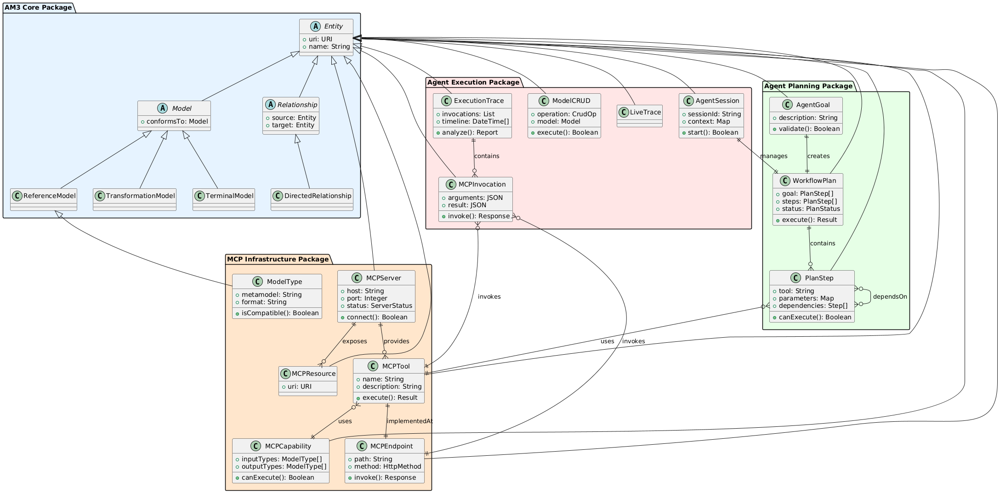

# LLM-Based Autonomous Agents for Model-Driven Engineering (MDE)

This project implements autonomous agents powered by large language models (LLMs) to orchestrate Model-Driven Engineering (MDE) tools. It provides reasoning, planning, execution, and traceability over MDE workflows.

## Overview

### Problem

MDE tools such as ATL transformations and EMF models run as MCP servers. Orchestrating these tools automatically requires agents capable of reasoning about models, transformations, and workflows while maintaining full traceability.

### Solution

The system provides a **megamodel** that acts as:

- **Registry** – Maintains knowledge of all models, transformations, and MCP servers.
- **Reasoning Engine** – Checks compatibility and generates workflow plans.
- **Execution Engine** – Executes multi-step workflows using MCP servers.
- **Audit System** – Tracks all operations for full traceability.

### Example Workflow

1. Agent receives a task: transform a Class model into a Relational model.
2. Agent queries the megamodel for available transformations.
3. Agent plans the workflow: select the Class2Relational transformation.
4. Agent executes the workflow: call ATL server, apply transformation, validate results.
5. All steps are logged in traces and sessions for traceability.

---

## Reading Order to Understand the Code

### Phase 1: Core Concepts

- **`src/core/am3.py`** – Defines core entities, models, and relationships.  
  Provides the foundational vocabulary of the MDE environment.
- **`src/core/megamodel.py`** – Implements the registry.  
  Stores all entities and manages their interconnections.

### Phase 2: MCP Integration

- **`src/mcp/infrastructure.py`** – Abstract representations of MCP servers, tools, and capabilities.
- **`src/mcp/integrator.py`** – Connects existing ATL/EMF servers to the megamodel.
- **`src/mcp/client.py`** – Handles communication and invocation of server tools.

### Phase 3: Agent Behavior

- **`src/agents/planning.py`** – Defines goals, plans, and workflow steps.
- **`src/agents/execution.py`** – Manages sessions, traces, and execution tracking.
- **`src/agents/workflow.py`** – Orchestrates the execution of workflow plans.

### Phase 4: Examples

- **`src/examples/main.py`** – Demonstrates the complete workflow from start to finish.

---

## Key Concepts

### AM3 Megamodel (Core)

- **Entity** – Represents any MDE artifact (models, transformations, etc.).
- **Relationship** – Defines connections between entities (`conformsTo`, `transforms`).
- **Registry** – Central store maintaining knowledge of all entities.

### MCP Integration

- **Server** – Existing ATL/EMF servers.
- **Tool** – Operations available on a server (e.g., applying a transformation).
- **Capability** – Supported input and output model types for each tool.

### Agent System

- **Goal** – Desired outcome for the agent.
- **Plan** – Step-by-step workflow to achieve the goal.
- **Session** – Execution context capturing traceable history.
- **Trace** – Record of operations performed during execution.

---

## Features

- **Reasoning** – Determines whether transformations can be applied to given models.
- **Planning** – Generates multi-step workflows to reach complex goals.
- **Execution** – Interfaces with MCP servers to perform transformations.
- **Traceability** – Logs all operations and decisions for auditing and reproducibility.
- **Adaptability** – Can adjust workflows based on execution results.
- **Learning** – Captures successful workflow patterns for reuse.

