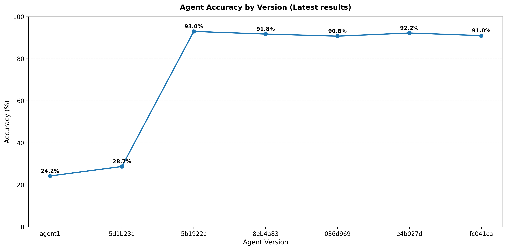
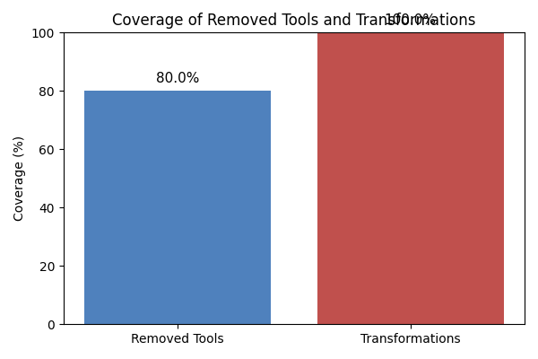

# A Megamodel-based Approach to Support Ecosystems of LLM Agents for Model-Based Engineering

## Abstract

### Context
The Model-Based Engineering (MBE) of large and complex software-intensive systems require to perform many engineering tasks over time. These tasks imply to create, modify, and reason on different modeling artifacts (metamodels, models, etc.) manipulated with various modeling tools (for model transformation, model views, etc.). In this context, the involved engineers could clearly benefit from intelligent agents that could support them in performing more efficiently their MBE tasks.

### Challenge
Recently, new initiatives appeared with the objective to agentify individual MBE tasks (e.g. model transformation) by relying notably on Large Languages Models (LLMs). However, automatically (at least partially) designing and executing complete modeling workflows in a smart way remains challenging. This is more particularly the case if we now consider combining together multiple MBE agents carrying out part of the targeted engineering tasks. Indeed, such LLM-based agents need to have access to the information related to all the available resources in order to be able to react appropriately.

### Solution
As a first step in this direction, we propose an approach that aims to provide the global knowledge on and to such a MBE agents ecosystem. Based on a dedicated megamodel we designed and the related tooling support, we can capture, represent, and reuse in an unified way all the required metadata. This concerns all the involved modeling artifacts, the corresponding tools and their associated LLM-based agents, as well as traces or logs of their practical executions in different contexts. Thus, in addition to modeling entities, the proposed megamodel registry also allows to track other useful elements such as MBE servers (e.g. using MCP), sessions or workflow plans.

### Results
We illustrate the applicability of the proposed approach and underlying tooled megamodel by applying them in the context of three complementary use cases. First, we consider the automated generation of datasets for MBE tools and workflows that a given company wants to test. Second, we collect the corresponding execution traces and navigate them to identify potential issues with the tested tools/workflows. Third, we reuse all the available information to generate a more detailed performance report targeting the improvement of workflow efficiency.

# Megamodel approach


**Motivation of the Megamodel Work**

The megamodel approach in this project addresses several challenges in Model-Driven Engineering (MDE):

**Unified Knowledge Representation**

The megamodel serves as a central registry that formally represents all artifacts within the model-driven ecosystem, structured across four key dimensions. First, **modeling artifacts**; including models, metamodels, and transformations; are treated as first-class entities with explicit relationships, conformance links, and compatibility information. Second, **tooling artifacts** such as MCP servers, tools, and their capabilities are registered and dynamically discovered, enabling the runtime composition of modeling services. Third, **agent artifacts** capture LLM-based agents along with their goals, workflow plans, and execution strategies, integrating intelligent behavior into the megamodel. Finally, **execution trace artifacts** record MCP invocations, trace steps, and execution results, preserving a complete history of all transformations and operations for traceability and analysis.

**Traceability and Verification**

By maintaining relationships between all modeling artifacts, the megamodel provides end-to-end traceability from source to target models. This tracing is essential for:

1. Verification of complex transformation processes.
2. Understanding the evolution of models throughout their lifecycle.
3. Analyzing execution patterns through the captured trace components.

**Dynamic Tool Discovery and Composition**

The framework discovers available transformation tools at runtime through MCP servers, allowing for flexible composition of modeling services. This enables workflows that can adapt to available capabilities rather than requiring hardcoded transformation paths.


​			**Figure: Metamodel of the megamode**l *This is not the last version of the metamodel ( enhancements need to be made)*
.png)


The megamodel consists of four main layers. The first component is the **Modeling artefacts**, where **Models** are the central elements. A model inherits from the **Entity** class, and entities are linked through **Relationship types**. A **Terminal model** acts as an instance of a **Reference model** (see the corrected figure). One subtype of the terminal model is the **Transformation model**, which transforms a source model into a target model. Another subtype is the **Virtual model**, which generates a **Model view**. The model view conforms to its metamodel, called **ModelViewPoint**, which includes multiple contributing metamodels involved in the action.

The **Tooling artefacts** revolve around the **Tool** component. **MCP servers** expose **MCP tools**, along with other **MCP resources**, such as files and related assets.

As for the **Agent artefacts**, we have a generic **MBE Agent**, which can represent any specific MDE task–related agent. For instance, there can be a **Transformation agent** that uses MCP tools exposed by the connected servers accessible in the repository. When the agent receives an **Agent goal**; a natural language instruction; it generates a **WorkflowPlan** composed of several **PlanSteps**, depending on the complexity of the goal.

When the execution is completed, we can capture the corresponding **execution traces** in the **Agent session**, which mainly contains **TraceSteps**, representing the execution of the PlanSteps generated by the agent.


The **workflow generation** process plays a key role in structuring how an agent executes a given goal. When an **Agent goal** is received, the agent interprets the natural language instruction and decomposes it into a sequence of **PlanSteps**, each representing a concrete operation to be performed using available **MCP tools**. This structured workflow, captured in the **WorkflowPlan**, ensures that the agent’s actions are explicit, traceable, and reproducible. It also facilitates reasoning about dependencies between steps, the selection of appropriate tools, and the reuse of previous execution traces for similar goals. In the context of the megamodel, workflow generation bridges high-level user intent with operational artefacts, connecting the **Agent artefacts** to the **Tooling** and **Modeling artefacts** through a consistent execution logic.


#### Dataset generation process

# 

The dataset generation process follows a two-track approach for creating single-tool and multi-tool examples.

We start by querying the **megamodel repository** to obtain the available tools from the accessible **MCP servers**. 

We extract a **List<SingleToolSeeds>** . For each single tool, we **Get Seeds** to obtain 3 seed examples. The **Get Name & Description** action provides the **ToolName, description** which, together with the **LLM Prompt Template (SingleTool)** and **Company tools TBT**, is used for **LLM generation**. The LLM is instructed to generate instructions that use these tools, producing **Instruction, API call** pairs that undergo **Human manual validation**. Validated examples are stored in **SubDataset: SingleTool**.

In parallel, we process **Company tools TBT** to **Sample Tools** from the available **Company workflows TBT**. We then **List<Tools selected >** to determine which tools to combine. The **Get Names & Descriptions** action retrieves **ToolName, descriptions** for the selected tools. We extract **List<MultiToolSeeds>** and perform **Seed sampling** to obtain 3 seeds. Using the **LLM Prompt Template (MultiTool)** together with the tool information, we perform **LLM generation** to produce **Instruction, API calls** pairs. These generated examples undergo **Human manual validation** and are added to **SubDataset: MultiTool**.

Both subdatasets are combined with **Ground truth validation** to produce the **Final dataset**.


To ensure the correctness and reliability of the augmented synthetic dataset, we perform a validation using three categories of metrics: token-level metrics, embedding-level metrics, and human evaluations.


# Experimentation settings


# *I- Dataset validation*


## Metrics' Categorization:  token-level metrics, embedding-level metrics, and human evaluations.


### Embedding-level metrics ( EMBEDDING_MODEL = "text-embedding-3-small")

#### 1. Distance

**Definition**: Average pairwise Euclidean distance between all embedding vectors in the dataset.

**Technical Details**:

- For a dataset with N embeddings, computes the Euclidean distance between each pair of vectors (N*(N-1)/2 pairs)
- Calculated as:  mean(√Σ(xi - yi)²) for all pairs of points
- How far apart examples are from each other in the embedding space. Higher values mean examples are more spread out and diverse.
- Scale depends on the embedding dimension and magnitude'how large the vector is in that space' (1536 dimensions for OpenAI embeddings)

**Real-world analogy:** Like measuring how far apart people are standing in a room.
**Concrete example:** If the dataset contains instructions about "cooking pasta," "fixing a car," and "training a dog," they would have high distance because they're about completely different topics.

#### 2. Dispersion

**Definition**: One minus the average cosine similarity between all embedding vector pairs.

**Technical Details**:

- Normalizes embeddings to unit length first: [embedding / ||embedding||]
- Computes cosine similarity matrix using  sklearn.metrics.pairwise.cosine_similarity
- Excludes self-similarities (diagonal elements of similarity matrix)
- Calculated as: `1.0 - mean(cos_sim)` where `cos_sim` is the pairwise cosine similarity
- Bounded between [0,1], where:
  - 0 means all vectors point in the same direction (identical content)
  - 1 means all vectors are orthogonal (maximally diverse content)


**Real-world analogy:** Like measuring if people are all facing the same direction or facing different ways.
**Concrete example:** Instructions might use similar words but have different meanings or intentions. "Open the window to let air in" and "Open the file to edit it" use "open" but in different contexts.
**What it tells you:** How different the intentions or meanings are, even if some words are similar.

#### 3. Isocontour Radius

**Definition**: Geometric mean of the standard deviations along each embedding dimension.

**Technical Details**:

- Computes standard deviation along each dimension:  std_devs = np.std(embeddings, axis=0)
- Filters out zero standard deviations to avoid numerical issues
- Calculates geometric mean: exp(mean(log(std_devs))) rather than arithmetic mean
- Represents the average spread of points along each dimension
- A smaller radius indicates tightly clustered data, larger values suggest more dispersed data

**Concrete example:** Some instructions might vary in length, detail, complexity, or technical language. This measures that variety across different aspects simultaneously.
**What it tells you:** How much variation exists across multiple characteristics at once, for instance if the generated dataset have bigger Isocontour Radius it means that its got more diverse in a certain aspect than the base dataset.


#### 4. Affinity

**Definition**: Cosine similarity between the mean embeddings of the seed and generated datasets.

**Technical Details**:

- Computes centroid (mean vector) for each dataset: `mean_embedding = np.mean(embeddings, axis=0)`

- Normalizes centroids to unit vectors for cosine similarity

- Calculates dot product of normalized centroids:  np.dot(mean_embedding1, mean_embedding2)

- Ranges from -1 to 1, where:

  - 1 indicates perfect semantic alignment between datasets
  - 0 indicates orthogonal (unrelated) datasets
  - -1 indicates semantic opposition (rarely occurs in practice)

- Measures how well the generated dataset preserves the semantic center of the seed dataset

  

  **Real-world analogy:** Like measuring whether two different groups of people are interested in the same kinds of activities.

  **Concrete example:** If you have a seed dataset about "home repairs" and your generated dataset is also about "home repairs," they would have high affinity. But if your generated dataset drifted to include many "cooking recipes," the affinity would be lower.

  **What it tells you:** How well the LLM-generated dataset stays on the same general topics as the original seed dataset.


### Token-level metrics

#### 5. Vocabulary Size

**Definition**: Count of unique words used across all instructions in the dataset.

**Technical Details**:

- Tokenizes all text by:
  - Converting to lowercase
  - Removing punctuation with regex `r'[^\w\s]'`
  - Splitting on whitespace
- Counts distinct tokens (words) using Python sets:  len(set(all_tokens))
- Pure lexical diversity measure (doesn't account for semantic similarity)
- Higher values indicate more diverse vocabulary

#### 6. Unique 3-grams

**Definition**: Count of unique consecutive three-word sequences across all instructions.

**Technical Details**:

- Uses same tokenization as vocabulary size
- Creates n-grams as sliding window of 3 consecutive tokens
- Joins tokens with spaces to create string representation
- Counts unique n-grams using Python sets: len(set(all_ngrams))
- Higher values suggest more diverse expression patterns


### Human evaluations

We will choose randomly 200 instructions ( 100 single-tool and 100 Multi-tool), then check them manually. 


#### Complete Analysis of the Diversity Metrics Chart


### ***Result analysis***

#### **DISTANCE Metric (How far apart topics are)**

**Single-Tool & Multi-Tool:**  The LLM creates topically closer instructions. Generated examples cluster around existing patterns, **maintaining semantic fidelity to the seeds** rather than diverging into unrelated topics. This reduction in topical spread indicates the LLM successfully preserves the core meaning and intent of the seed templates while creating variations, a desirable outcome that ensures generated data remains **on-topic and semantically aligned** with the original task domain.

------

#### **DISPERSION Metric (How different the meanings/intentions are)**

**Single-Tool & Multi-Tool:** The LLM produces instructions with more similar conceptual approaches and linguistic patterns. This convergence reflects the LLM's focus on **maintaining consistent intentional meaning** across variations, ensuring that generated instructions express the same core operations and goals as the seeds, just with different surface realizations. Rather than diverging into semantically distinct operations, the generated examples **preserve the semantic intent** while varying expression, which is desirable for maintaining dataset coherence and ensuring all examples serve the intended purpose of model transformation instructions.

**Overall:**  Multi-tool shows lower dispersion than single-tool simply because **multi-tool instructions are longer and more complex** (coordinating two operations), which means they share more semantic structure and grammatical patterns. Single-tool instructions are shorter and more varied in their simple expressions, allowing for greater semantic spread despite being in the same domain.

------

#### **ISOCONTOUR RADIUS**  

**Single-Tool & Multi-Tool:** The LLM generates instructions with **enhanced multi-dimensional diversity** across both datasets. Generated examples show richer variation in features length, complexity, formality, and grammatical structure, while maintaining semantic coherence with the seeds. This increase in isocontour radius (single-tool: +7.5%, multi-tool: nearly unchanged at -2.8%) demonstrates that the LLM successfully **diversifies expression patterns** across multiple embedding dimensions simultaneously, not just topical content. 

**Overall:** Multi-tool instructions show slightly lower isocontour radius than single-tool because compound instructions (coordinating two operations) naturally constrain stylistic variation,  they must maintain coherence across both operations, limiting how freely each can vary in structure and complexity compared to standalone single-tool instructions.

------

#### Vocabulary size

**Single-Tool & Multi-Tool:** The LLM expands lexical diversity in both datasets (single-tool: ×3.0 from 62 to 189 words; multi-tool: ×3.6 from 65 to 233 words). This increase demonstrates the LLM's ability to **introduce varied terminology and expressions** while maintaining semantic coherence with the seed templates. The generated instructions use a much richer vocabulary, incorporating different technical terms, verbs, and descriptive language that enhance the dataset's linguistic coverage without straying from the model transformation domain.

**Overall:** Multi-tool shows slightly higher vocabulary expansion (×3.6 vs ×3.0), indicating that the complexity of coordinating two operations naturally requires and produces more diverse word choices to express different transformation combinations and their relationships.

#### Unique 3-grams

**Single-Tool & Multi-Tool:** The LLM achieves exceptional phrase-level diversity in both datasets (single-tool: from 71 to 1235 unique 3-grams; multi-tool: from 133 to 1700 unique 3-grams). This increase in unique three-word sequences reveals that while the LLM maintains semantic alignment (lower distance/dispersion), it generates **highly varied phrasal constructions and expression patterns**. The generated instructions explore numerous ways to phrase operations and structure sentences, creating rich linguistic variation that benefits model robustness.

**Overall:** Single-tool shows a higher multiplication factor (×17.4 vs ×12.8) despite producing fewer total 3-grams, suggesting that shorter single-operation instructions allow for more radical phrasal restructuring. Multi-tool's lower factor reflects the structural constraints of coordinating two operations, which limits how freely phrases can be rearranged while maintaining coherence.


#### **Summary: Balancing Semantic Fidelity with Linguistic Diversity**

The dataset generation process demonstrates a trade-off: while the LLM reduces topical and semantic diversity (distance: -6% to -14%, dispersion: -10% to -25%) to maintain faithful alignment with seed templates, it simultaneously achieves substantial gains in linguistic and lexical diversity (vocabulary: ×3.0-3.6, 3-grams: ×12.8-17.4, isocontour: +7.5% for single-tool). This pattern reveals that **semantic convergence does not imply linguistic monotony**, the generated datasets preserve the core meaning and intent of model transformation instructions while exploring rich variation in expression styles, phrase structures, and vocabulary. Overall, the generation process proves effective for scaling datasets while maintaining quality and purpose.

# II- Agent and Prompt Enhancement Evaluation

To assess the impact of architectural changes on agent performance, we implemented a systematic evaluation using the validated dataset ( Sub section above). Given that modifications to agent parameters (temperature, prompt structure, reasoning strategies) provide no inherent guarantee of improvement, we required an objective measurement approach to track the effects of development decisions.

**Methodology:**

- We extracted the commit history from an existing agent development repository and identified commits that modified the agent's core architecture. These modifications included prompt template changes, parameter tuning (temperature, model used, etc.)...

Each commit was evaluated in chronological order against the validated dataset. For every version, we measured task completion accuracy, instruction following fidelity, tool usage correctness, and overall success rate across all dataset examples.

**Evaluation Process:**

1. **Commit extraction:** Identified architectural change commits from the development timeline

2. **Sequential evaluation:** Tested each agent version against the complete dataset in chronological order

3. **Metric collection:** Recorded accuracy and performance metrics for each version

4. **Comparative analysis:** Tracked performance deltas between consecutive versions



**Results:**

Figure 3 shows the accuracy progression across agent versions. The evaluation reveals:

- Initial baseline (agent1): 24.2% accuracy
- First architectural iteration (5d1b23a): 28.7% accuracy (+4.5 percentage points)
- Major improvement (5b1922c): 93.0% accuracy (+64.3 percentage points)
- Subsequent versions: Fluctuation between 90.8% and 92.2% accuracy
- Final version (fc041ca): 91.0% accuracy

The data demonstrates that architectural changes produced variable impacts. The transition to version 5b1922c represented the most significant improvement, primarily due to switching from the Ollama model to GPT-4 models. This model upgrade, combined with relevant tool retrieval using RAG, enabled the agent to achieve consistently higher accuracy. Later iterations showed marginal variations between 90.8% and 92.2%, suggesting that with GPT-4 and RAG-based tool selection in place, the architecture had reached a stable performance plateau where further prompt and parameter adjustments yielded diminishing returns. 

**Developer Visibility:**

This approach provides development teams with:

- Quantitative evidence of change impacts
- Identification of beneficial vs. detrimental modifications
- Historical performance tracking for rollback decisions
- Data-driven guidance for future architectural choices

By maintaining chronological evaluation records, developers gain visibility into how specific architectural decisions affect agent behavior across diverse instruction types, enabling informed iteration and preventing regression.


# Missing tools ablation test 


## Experimental Design

We removed 10 transformation tools from the agent's MCP server registry to test whether the dataset detects capability gaps. The removed tools cover 5 transformation workflows, each consisting of a list and apply operation for specific model transformations: KM32EMF, MySQL2KM3, Families2Persons, XML2Ant, and Make2Ant.

```python
TOOLS_TO_REMOVE = [
    "list_transformation_KM32EMF_tool",
    "apply_KM32EMF_transformation_tool",
    "list_transformation_MySQL2KM3_tool",
    "apply_MySQL2KM3_transformation_tool",
    "list_transformation_Families2Persons_tool",
    "apply_Families2Persons_transformation_tool",
    "list_transformation_XML2Ant_tool",
    "apply_XML2Ant_transformation_tool",
    "list_transformation_Make2Ant_tool",
    "apply_Make2Ant_transformation_tool"
]
```


The agent was evaluated on 200 randomly selected instructions from the validated dataset. This sample size provides sufficient coverage across single-tool and multi-tool instruction types while maintaining computational efficiency.

## Purpose

This test verifies three aspects of the evaluation framework. First, it confirms whether the evaluation correctly identifies failures when required tools are missing. Second, it assesses whether the instructions adequately sample tool dependencies across the transformation space. Third, it reveals how the agent handles missing capabilities and whether it fails gracefully or attempts incorrect workarounds.

## Results


The ablation test successfully detected over **80%** of instructions that required the removed tools, and **100%** of transformation-related instructions were correctly identified, this demonstrates the dataset coverage. Agent accuracy dropped from **91.0%** at baseline to **77%** when evaluated on the subset with tools removed. This performance degradation confirms that the dataset robustly exercises each tool's functionality and that the evaluation framework effectively captures tool-dependent task failures.

This ablation study demonstrates a second use case for the validated dataset beyond measuring agent accuracy. The dataset enables robustness analysis by identifying critical tool dependencies and testing agent behavior under degraded conditions. Development teams can use this approach to map tool dependency relationships, prioritize tool development based on impact, test agent behavior under partial tool availability, and validate tool discovery mechanisms.

### Coverage Chart

The following chart summarizes the coverage of removed tools and transformations during the ablation (tool removal) experiments and provides a visual overview of which tools and transformations are most affected:




## References:

### [Diversity-oriented data augmentation with large language models](https://arxiv.org/abs/2502.11671) All metrics

### [Evaluating the evaluation of diversity in natural language generation](https://arxiv.org/abs/2004.02990) cited: 130, distinct‑n lexical metrics

### [Diversity, density, and homogeneity: Quantitative characteristic metrics for text collections](https://arxiv.org/abs/2003.08529) cited : 28,  isocontour radius = embedding diversity

### [Can data diversity enhance learning generalization?](https://aclanthology.org/2022.coling-1.437/) Published & cited : 49, embedding dispersion as pairwise cosine distances

### [**Affinity** and **diversity**: **Quantifying mechanisms** of **data augmentation**](https://arxiv.org/abs/2002.08973) Cited: 81 

### [Directed diversity: Leveraging language embedding distances for collective creativity in crowd ideation](https://dl.acm.org/doi/abs/10.1145/3411764.3445782) **Distance / Dispersion (avg pairwise Euclidean / 1 − avg cosine similarity)** , cited 56, Published ( à vérifier)

### [Geometry of textual data augmentation: Insights from large language models](https://www.mdpi.com/2079-9292/13/18/3781)  **(cosine between mean embeddings / centroid similarity)** , Published

### [Large language model as attributed training data generator: A tale of diversity and bias](https://proceedings.neurips.cc/paper_files/paper/2023/hash/ae9500c4f5607caf2eff033c67daa9d7-Abstract-Datasets_and_Benchmarks.html) cosine similarity, published and cited + 300 