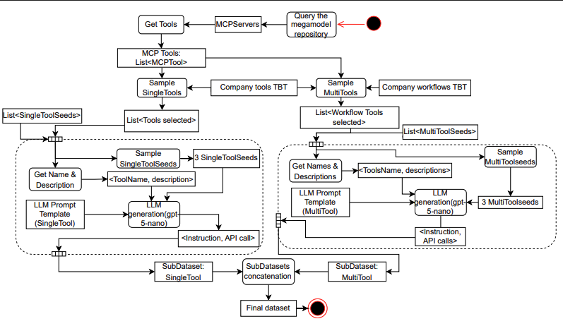

# LLM Agent Evaluation for Model-Driven Engineering

## 1. Megamodel and Registry

The megamodel provides descriptions of LLM-based agents, associated tools, underlying artifacts/models, and execution traces. It is organized in four parts: core artifacts (models, metamodels, transformation models), tooling artifacts (tools, servers), agent artifacts (agents, workflows, steps), and execution traces (traces, invocations).

- **Implementation**: `src/core/megamodel.py`
- **Population**: The megamodel is populated at agent initialization via `populate_registry()` (see `scripts/run_agent_versions.py`)

## 2. Dataset Generation



Domain-specific seed examples provided by experts serve as templates capturing linguistic patterns and technical requirements of real-world tool usage. Seeds are organized into single-tool seeds (single tool operations) and multi-tool seeds (tool composition patterns), further categorized by operation patterns (transformation application, information retrieval). The generation follows a two-track approach to expand seeds while maintaining quality.

The process begins with querying the megamodel repository, followed by getting available tools from MCP servers, which guide the synthetic generation.

**Single-Tool instructions**: MCP tools are extracted as `List<MCPTool>`. The system validates that company tools exist and are exposed by MCP servers. For each validated tool, tool information (`<ToolName, description>`) is extracted. Three seeds matching the pattern (application vs. information retrieval) are retrieved. These seeds, along with tool name, description, and generation rules, are incorporated into an LLM prompt template. The LLM generates natural language instructions paired with corresponding API calls (`<Instruction, API call>`). Target examples are divided equally among available tools for balanced representation. Generated instruction-API pairs are added to the `SubDataset: SingleTool` subdataset. Progress is saved incrementally to support resumption after interruption.

**Multi-Tool instructions**: Multi-tool generation operates on two-step workflows from available tools. The system decomposes company workflows and validates that each constituent tool exists and is exposed by connected MCP servers. Validated tools are classified by operation patterns (application vs. information retrieval) generating four workflow categories: application -> application, application -> info, info -> application, info -> info (`List<Tools selected(2)>`). Workflows are distributed so each tool appears in equal numbers. For each workflow, tool pair information (`<ToolName, description>`) and operation patterns are extracted. Three pattern-matching seeds are sampled from the multi-tool seed repository; if fewer than three matching seeds exist, it supplements with seeds from other patterns. These seeds, tool sequence information, and multi-step generation rules are incorporated into an LLM prompt template. The LLM generates instructions coherently connecting the two operations (`<Instruction, API calls>`). Duplicates are filtered during generation. Generated examples are validated for proper structure before being added to the `SubDataset: MultiTool` subdataset. Progress is saved incrementally with separate tracking for remainder generation.

Both subdatasets are combined and undergo final validation to produce the final dataset. Validation checks that each example contains a valid instruction string and properly formed API calls list with non-empty API names. This augmentation process expanded the dataset from 21 instruction seeds to 1000 generated instruction-API pairs.

- **Location**: `dataset generation/`
- **Scripts**:
  - `single_tool_generate.py` - Single-tool instruction generation
  - `multi_tool_generate.py` - Multi-tool instruction generation  
  - `pipeline.py` - End-to-end generation pipeline
- **Seed instructions**: `dataset generation/seeds/`
  - `all_tools/` - ATL tool seeds
  - `uml_tools/` - UML tool seeds
  - `openrewrite/` - OpenRewrite seeds
- **Generated datasets**: `dataset generation/outputs/`
  - `atl_tools/` - Contains `simple_500_dataset.json`, `multi_500_dataset.json`
  - `uml/` - Contains `uml_500_dataset.json`, `uml_multi_500_dataset.json`
  - `openRewrite/` - Contains `single_openRewrite_500_dataset.json` , `multi_openRewrite_500_dataset.json`
  
**To generate datasets**:

1. Set OpenAI API key in `.env` file at project root:

   ```bash
   OPENAI_API_KEY=your_api_key_here
   ```

2. Run the generation pipeline:

   ```bash
   cd "dataset generation"
   python3 pipeline.py  # Runs the full generation pipeline for all tool categories
   ```

- **LLM used**: GPT-5 nano for instruction generation
- **Embedding model**: text-embedding-3-small in the dataset validation (for diversity metrics)

## 3. Dataset Validation Metrics

Validates dataset diversity using six metrics from dataset augmentation research.

- **Library**: Uses `openai` for embeddings, `scipy` for distance calculations, `sklearn` for cosine similarity
- **Analysis script**: `dataset generation/analyze_dataset_diversity.py`
- **Metrics calculated**:
  - Distance (average pairwise Euclidean distance)
  - Dispersion (1 - average cosine similarity)
  - Isocontour Radius (geometric mean of per-dimension standard deviations)
  - Affinity (similarity between seed and augmented dataset means)
  - Vocabulary Size (unique words)
  - Unique 3-grams (distinct 3-word sequences)

**To reproduce results**:

1. Generate CSV metrics for each dataset:

   ```bash
   cd "dataset generation"
   python3 analyze_dataset_diversity.py  # Generates CSV files in outputs/atl_tools/, outputs/uml/, outputs/openRewrite/
   ```

2. Visualize metrics as charts:

   ```bash
   python3 visualize_metrics.py  # Generates PNG charts
   ```

- **Output charts**: `dataset generation/experimentation_charts/`
  - `atl_tools/` - ATL and All Tools metric visualizations
  - `uml_tools/` - UML metric visualizations
  - `openrewrite_tools/` - OpenRewrite metric visualizations

## 4. Agent Benchmarking

Evaluates seven agent versions against the generated dataset and the seed dataset.

- **Agent versions**: `evaluation/agent_versions/` (agent1.py through agent7.py)
- **Execution script**: `scripts/run_agent_versions.py`
- **Results**: `outputs/agent_version_logs/`
  - `version_1/` through `version_7/` - Execution logs per agent version
  - `report_generation.csv` - Augmented dataset results
  - `seeds_report_generation.csv` - Seed dataset results
- **Evaluation**: `outputs/evaluate_accuracy.py`
- **Visualization**: `outputs/visualize_accuracy_comparison.py`
- **Output plots**: `outputs/plots/agent_accuracy_comparison.png`

## 5. Ablation Test

Tests agent performance with reduced tool availability.

- **Script**: `scripts/run_agent_reduced_tools.py`
- **Analysis**: `outputs/ablation_test/instruction_analysis.py`
- **Results**: `outputs/ablation_test/`
- **Coverage charts**: `outputs/plots/coverage_chart_seeds.png`

## MCP Servers used in the paper

Servers expose tools via the Model Context Protocol for agent execution.

- **ATL server**: `mcp_servers/atl_server/` - Model transformations (includes UML transformations)
- **OpenRewrite servers**: `mcp_servers/openRewrite_servers/` - Code refactoring

## Requirements

Install dependencies:

```bash
pip install -r requirements.txt
```
